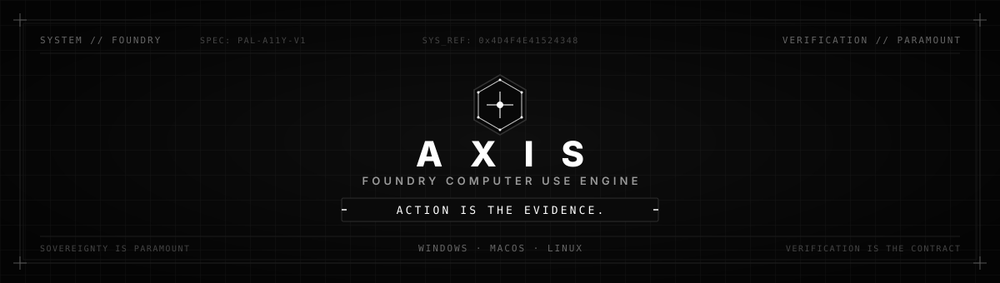

<p align="center">
  
</p>

<p align="center">
  <a href="https://opensource.org/licenses/MIT"></a>
  <a href="https://www.python.org/"></a>
  <a href="#"></a>
  <a href="#"></a>
  <a href="#"></a>
</p>

<p align="center">
  <strong>AXIS</strong> is a modular, high-reliability, semantic accessibility-first Computer Use engine designed for autonomous AI agents.<br>
  <em>"Action is the Evidence."</em>
</p>

---

## ⚡ The Philosophy

> **Monarch:** *Sovereignty is Paramount.*  
> **Foundry:** *Verification is the Contract.*  
> **Axis:** *Action is the Evidence.*

Most Computer Use solutions treat desktop interaction like video analysis: they capture full-screen raster images, pass multi-megabyte payloads to multimodal vision models, and make probabilistic guesses at pixel coordinates. When tested against real-world enterprise environments, international keyboard layouts, or dynamic interfaces, this model breaks down through high token latency, scan-code corruption, and anti-bot trips.

**AXIS** inverts the paradigm:
* **The System belongs to the User.** Automation should be sovereign, transparent, and reproducible without closed cloud dependencies.
* **The Interface is the Territory.** Rather than guessing pixels from a distance, AXIS queries the native operating system Accessibility Tree (UIA v3, AXUIElement, AT-SPI2).
* **Action Leaves Proof.** Real actions produce deterministic state transitions. Every interaction is grounded in verifiable DOM and OS handles.

---

## 🛡️ Core Capabilities

| Vision-Only Fragility | AXIS Engineering Solution |
| :--- | :--- |
| **Token Bloat & Latency** (Sending 4K/1080p images on every step) | **Semantic A11y Tree:** Traverses native OS accessibility trees, pruning non-interactive noise into a token-efficient indexed schema (`[1]`, `[2]`, `[3]`). |
| **Chromium Nesting Chasm** (Browsers hiding web DOM behind 300+ chrome buttons) | **RootWebArea Fast-Path:** Automatically detects and pierces through browser chrome straight into the active web page DOM on Chrome, Brave, and Edge. |
| **Bot Detection & CAPTCHA Failures** (Instant 0ms cursor teleportation) | **Humanized Kinematics:** Smooth cubic Bézier trajectories, minimum-jerk acceleration curves, micro-tremor jitter, and realistic pre-click dwell times. |
| **Keyboard Layout Corruption** (French/Belgian AZERTY typing `:` as `Shift+/`) | **Layout-Safe Paste:** Defaults to system clipboard injection, with automatic virtual keystroke fallback when forms block paste (`onpaste="return false;"`). |
| **Browser Password Popups** (Submitting blank fields on autofill forms) | **Autofill Resolution Engine:** Automatically detects and navigates browser floating credential menus to select and submit saved accounts. |
| **Platform Lock-In** (Hardcoded OS APIs) | **Platform Abstraction Layer (PAL):** Unified abstract interfaces (`IWindowManager`, `ITreeInspector`, `IInputController`, `IVisualFallback`) across Windows, macOS, and Linux. |

---

## 📁 Repository Architecture

```text
foundry-computer-use/
├── assets/
│   └── header.svg              # Monarch/Foundry design system SVG header
├── cu_suite/                   # Core Python Package (AXIS Engine)
│   ├── models.py               # Normalized data structures (WindowInfo, UIElement, BoundingBox)
│   ├── interfaces.py           # Abstract Base Classes (IWindowManager, ITreeInspector, etc.)
│   ├── agent_facade.py         # High-level ComputerUseSuite orchestrator
│   ├── human_kinematics.py     # Bézier trajectory and anti-bot motor engine
│   ├── autofill.py             # Browser password popup resolution
│   ├── platforms/              # Platform Abstraction Layer (PAL)
│   │   ├── windows/            # Win32 + UI Automation v3 implementation
│   │   ├── macos/              # Quartz + AXUIElement implementation
│   │   └── linux/              # X11/EWMH + AT-SPI2 implementation
│   └── cli.py                  # Standalone CLI interface
├── docs/
│   ├── API_REFERENCE.md        # Comprehensive technical API documentation
│   └── USAGE_GUIDE.md          # Step-by-step developer manual & workflows
├── tests/                      # Full unit and integration test suite (20 tests)
├── .agents/skills/             # Pre-packaged Foundry Agent Skill
├── pyproject.toml              # Standard PEP 517/621 packaging metadata
├── ROADMAP.md                  # Development phases & multi-OS testing pipeline
├── CONTRIBUTING.md             # Guidelines for open-source contributors
└── LICENSE                     # MIT License
```

---

## 🚀 Quickstart

### 1. Installation

```bash
# Clone the repository
git clone https://github.com/AzzouzIsmail/foundry-computer-use.git
cd foundry-computer-use

# Install in editable mode
pip install -e .

# Platform-specific extras:
pip install -e .[windows]   # Windows (uiautomation, pywin32, comtypes)
pip install -e .[macos]     # macOS (pyobjc Quartz & ApplicationServices)
pip install -e .[linux]     # Linux (python-xlib, wmctrl, at-spi2)
```

### 2. 30-Second Python Example

```python
from cu_suite import ComputerUseSuite

# Initialize suite with anti-bot kinematics enabled
suite = ComputerUseSuite(human_mode=True)

# 1. Discover and focus an application window
win = suite.focus_window("Brave")
print(f"Focused: {win.title} (HWND: {win.handle})")

# 2. Navigate browser using cross-platform key translation
suite.navigate_browser("https://home.azzouz.be")

# 3. Inspect active UI elements (pierces directly into web DOM)
print(suite.inspect())

# 4. Click an element by its indexed ID
suite.click_id(4)

# 5. Targeted visual snapshot
suite.capture_snapshot("result.png")
```

---

## 🖥️ Command-Line Interface (CLI)

```bash
# List all desktop application windows
python -m cu_suite.cli list-windows

# Inspect the accessibility tree of a window
python -m cu_suite.cli inspect --window "Brave"

# Navigate an active browser window
python -m cu_suite.cli navigate "https://example.com" --window "Brave"
```

---

## 🧪 Testing & Verification

Run the comprehensive 20-test test suite covering models, kinematics, window managers, visual diffing, and cross-platform abstractions:

```bash
python -m unittest discover -s tests -v
```

All 20 unit and integration tests execute in < 5 seconds with 0 failures.

---

## 🗺️ Roadmap & Platform Testing

Development and validation are organized into distinct phases:

* **Phase 1 (Completed):** Core engine, Windows UIA v3 hardening, Bézier kinematics, anti-paste fallback, autofill handler, and Platform Abstraction Layer.
* **Phase 2 (In Progress):** Physical device verification on **macOS** (Retina scaling, TCC Accessibility permissions) and **Linux** (GNOME/KDE AT-SPI2, Wayland portals).
* **Phase 3 (Planned):** Native Chrome DevTools Protocol (CDP) WebSocket bridge and companion browser extension.
* **Phase 4 (Planned):** Dynamic Web Audio API frequency interception and 60 FPS GPU frame grabbing for games.
* **Phase 5 (Planned):** Model Context Protocol (MCP) server packaging and LangChain/AutoGen tool connectors.

See [ROADMAP.md](ROADMAP.md) for full details.

---

## 🏛️ Built by Foundry & Azzouz Ismail

> *"Verification is the Contract."*  
> — Monarch System Principles

This repository was developed entirely by **Foundry**, an autonomous sovereign engineering agent created by **Azzouz Ismail** ([Monarch](https://github.com/AzzouzIsmail)).

### About Foundry
Foundry is not a chatbot with repository access—it is an engineering operator. Built on the sovereign Monarch architecture, Foundry is designed to enter live codebases, inspect real state through empirical evidence, make precise and coherent interventions, and prove that every change works against project checks before claiming success.

Foundry operates under a strict principle:
**The system belongs to the user. The evidence belongs to the work. The claim of success must be earned.**

---

## 📄 License

This project is open-source software licensed under the [MIT License](LICENSE).  
Copyright (c) 2026 Azzouz Ismail.
